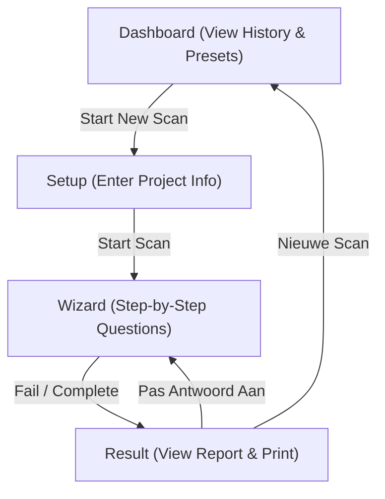

<!-- docs\development\issue3\design.md -->
<!-- template=design version=5827e841 created=2026-07-09T19:35Z updated=2026-07-09T19:36Z -->
# Design for Centralized Styling Themes & Metadata SsoT

**Status:** APPROVED  
**Version:** 1.1  
**Last Updated:** 2026-07-09  
**Validation Outcome:** PASS  
**Issue:** #3  

---

## 1. Context & Requirements

### 1.1. Problem Statement

Design fragmentation and hardcoded metadata strings across the workspaces violate DRY and SSOT principles. The dark mode theme of the Maatwerk Scan conflicts with the warm Neo-brutalisme checklist, and terminology is inconsistent.

### 1.2. Requirements

**Functional:**
- [x] Centralized `themes.css` providing at least `theme-brutalist` and `theme-dark` custom CSS properties.
- [x] Centralized `apps-metadata.json` at the monorepo root defining `id`, `name`, `subtitle`, `description`, `path`, `icon`, `defaultTheme`, and `order` for each app.
- [x] Refactor both scans (`project_intake_scan` and `maatwerk_risico_scan`) and the `fysiek_fabriek_portal` to consume the centralized styling.
- [x] Align FysiekFabriek Portal to display the Project Intake Scan before the Maatwerk Risico Scan.
- [x] Structural layout parity for Maatwerk Scan (Dashboard with history, Setup, Wizard card, printable Result report).
- [x] Consequent terminology change from triage/checklist to Scan.
- [x] Centralize print CSS selectors in `themes.css` to enable clean PDF/Paper reports for both scans.

**Non-Functional:**
- [x] Strict type safety for metadata imports using shared TypeScript interfaces.
- [x] Maintain standalone Vercel workspace deployability.
- [x] Zero code logic modifications to clinical triage/MDR rules.

---

## 2. Design Options

### 2.1. Option A: Centralized Theme System & SsoT Metadata Config (Preferred)

Centralized themes sheet, SsoT JSON config, and refactoring both sub-apps and portals to use abstract style classes.

*   **Pros**:
    *   100% DRY styling: colors, border-widths, and shadows are defined in one place.
    *   Easy theme switching: changing the theme class on the root element instantly updates the entire app.
    *   Eliminates all hardcoded strings (SSOT metadata).
    *   Consistent branding across both apps and portals.
*   **Cons**:
    *   Requires refactoring JSX templates to use variables instead of static values.

### 2.2. Option B: Localized styling edits only

Keep styles local, keep hardcoded names, and only change style classes inside the Maatwerk Scan JSX.

*   **Pros**:
    *   Low initial effort.
*   **Cons**:
    *   Violates DRY and SSOT.
    *   Fails the requirement of central styling control.
    *   Maintains fragmented styling and hardcoded configurations.

---

## 3. Chosen Design

**Decision:** Establish a centralized CSS custom properties theme system in `shared/styles/themes.css`, combined with a central `apps-metadata.json` configuration at the root. Refactor BOTH apps (`maatwerk_risico_scan` and `project_intake_scan`) and the `fysiek_fabriek_portal` to consume this centralized styling and metadata layout. Harmonize the layout of the Maatwerk Scan to match the checklist's dashboard/wizard structure, and standardize all user-facing names to 'Scan'.

**Rationale:** This design satisfies all DRY/SSOT requirements of `ARCHITECTURE_PRINCIPLES.md`, ensures visual consistency across the entire monorepo, and allows instant visual restyling of both sub-apps without deep code changes.

### 3.1. Key Design Decisions

| Decision | Rationale |
|----------|-----------|
| **Styling Centralization** | Both scans and portals share `themes.css` variables, eliminating hardcoded color and border width classes in JSX. |
| **Metadata SsoT** | Creates `apps-metadata.json` in root. Vite server configured with `fs.allow` to read it directly. |
| **Wizard Flow Parity** | Both apps implement a unified flow: Dashboard (with history) -> Setup -> Wizard (focused single card) -> Result. |
| **Terminology Standardization** | Establishes uniform naming convention to "Scan" across headings, UI elements, and reports. |

---

## 4. Technical Architecture Details

### 4.1. Metadata SsoT JSON Schema
A new `/apps-metadata.json` file is added at the root:
```json
{
  "apps": [
    {
      "id": "project_intake_scan",
      "name": "Project Intake Scan",
      "subtitle": "Scan uitdagingen",
      "description": "Doorloop de 11 criteria voor uitdagers en uitdagingen om te bepalen of een project past binnen de Fokus-formule.",
      "path": "/project_intake_scan/",
      "icon": "ClipboardList",
      "defaultTheme": "theme-brutalist",
      "order": 1
    },
    {
      "id": "maatwerk_risico_scan",
      "name": "Maatwerk Risico Scan",
      "subtitle": "MDR Stoplicht Risico Scan",
      "description": "Evalueer snel projecten aan de hand van het stoplichtmedisch model (Rood, Oranje, Groen). Inclusief interactieve FMEA-lite risicoanalyse.",
      "path": "/maatwerk_risico_scan/",
      "icon": "ShieldCheck",
      "defaultTheme": "theme-brutalist",
      "order": 2
    },
    {
      "id": "fysiek_fabriek_portal",
      "name": "FysiekFabriek Portal",
      "subtitle": "Hulpmiddelen & Risicobeoordeling",
      "description": "De overkoepelende startpagina specifiek voor alle FysiekFabriek hulpmiddelen en scans.",
      "path": "/fysiek_fabriek_portal/",
      "icon": "Layers",
      "defaultTheme": "theme-brutalist",
      "order": 0
    }
  ]
}
```

We define a shared TypeScript interface in `/shared/types/metadata.ts`:
```typescript
export interface AppMetadata {
  id: string;
  name: string;
  subtitle: string;
  description: string;
  path: string;
  icon: string;
  defaultTheme: string;
  order: number;
}
```

### 4.2. Central Styles definition (`shared/styles/themes.css`)
```css
.theme-brutalist {
  --bg-app: #fffdf9;
  --text-app: #1e293b;
  --accent-app: #f26522; /* Fokus orange */
  --border-app-width: 4px;
  --border-app-color: #1e293b;
  --shadow-app: 6px 6px 0px 0px rgba(30, 41, 59, 1);
  --shadow-app-small: 3px 3px 0px 0px rgba(30, 41, 59, 1);
  --radius-card: 24px;
  --radius-btn: 12px;
}

.theme-dark {
  --bg-app: #0f172a;
  --text-app: #f1f5f9;
  --accent-app: #f19d76; /* Peach orange */
  --border-app-width: 2px;
  --border-app-color: rgba(51, 65, 85, 0.6);
  --shadow-app: 0px 10px 15px -3px rgba(0, 0, 0, 0.4);
  --shadow-app-small: 0px 4px 6px -2px rgba(0, 0, 0, 0.3);
  --radius-card: 32px;
  --radius-btn: 16px;
}

/* Print utility classes shared by scans */
@media print {
  body {
    background-color: #ffffff !important;
    color: #000000 !important;
  }
  .print-hidden,
  header,
  footer,
  button,
  .print-hide {
    display: none !important;
  }
  .print-full-layout {
    width: 100% !important;
    max-width: 100% !important;
    margin: 0 !important;
    padding: 0 !important;
    border: none !important;
    box-shadow: none !important;
  }
  /* Remove shadow offset on paper */
  .shadow-app, .shadow-app-small {
    box-shadow: none !important;
  }
}
```

These variables are mapped in each app's `index.css` inside the `@theme` directive:
- [apps/project_intake_scan/src/index.css](file:///c:/1Voudig/99_Programming/FysiekFabriek-Triage/apps/project_intake_scan/src/index.css)
- [apps/maatwerk_risico_scan/src/index.css](file:///c:/1Voudig/99_Programming/FysiekFabriek-Triage/apps/maatwerk_risico_scan/src/index.css)
- [apps/fysiek_fabriek_portal/src/index.css](file:///c:/1Voudig/99_Programming/FysiekFabriek-Triage/apps/fysiek_fabriek_portal/src/index.css)

Tailwind theme mappings inside the css:
```css
@import "tailwindcss";
@import "../../../shared/styles/themes.css";

@theme {
  --color-bg-app: var(--bg-app);
  --color-text-app: var(--text-app);
  --color-brand-primary: var(--accent-app);
  --border-width-app: var(--border-app-width);
  --border-color-app: var(--border-app-color);
  --shadow-app: var(--shadow-app);
  --shadow-app-small: var(--shadow-app-small);
  --radius-app-card: var(--radius-card);
  --radius-app-btn: var(--radius-btn);
}
```

### 4.3. Unified Flow State Machine Diagram
Both applications will transition state according to the following wizard flow:



### 4.4. FMEA-Lite Matrix Interface & Layout
In the Maatwerk Scan Result view, when the triage status is Orange, the FMEA-lite table will be rendered within the printable report card:
```typescript
interface FmeaHazard {
  id: number;
  hazard: string;
  severity: '1' | '2' | '3' | '4' | '5';
  mitigation: string;
}
```
*   **Table Layout**: A high-contrast Neo-brutalist table with 2px borders (`border-2 border-slate-800`).
*   **Columns**:
    *   **Risico / Knelpunt**: Text describing the hazard.
    *   **Ernst**: A colored severity badge (Green for 1-2, Yellow for 3, Red for 4-5).
    *   **Mitigerende Maatregel**: Text explaining mitigation steps.

### 4.5. Portal App Card Ordering & Layout
In `apps/fysiek_fabriek_portal`, the application list will be sorted using the `"order"` field of `/apps-metadata.json`.
*   Portal app filters out its own ID (`fysiek_fabriek_portal`) and sorts using `apps.sort((a, b) => a.order - b.order)`.
*   The cards are rendered in Brutalist style (thick borders and flat shadows) utilizing the CSS classes `bg-bg-app`, `border-width-app`, `border-color-app`, and `shadow-app`.

---

## 5. Design Verification Strategy

1.  **TypeScript Compilation**: Compile all workspaces (`npx tsc --noEmit`) to verify strict typing of JSON metadata.
2.  **Linting**: Verify ESLint (`npm run lint`) returns zero errors and warnings.
3.  **Live Theme Switching proof**: Verify that switching an app's `defaultTheme` in `apps-metadata.json` instantly changes the styling layout of the application.
4.  **Local Storage Persistence**: Verify that both scans save history under their respective separate keys (`project_intake_scan_history` and `maatwerk_risico_scan_history`).

---

## 6. Traceability and Workspace Files
The following files are affected by this design:
*   [apps-metadata.json](file:///c:/1Voudig/99_Programming/FysiekFabriek-Triage/apps-metadata.json) [NEW]
*   [shared/types/metadata.ts](file:///c:/1Voudig/99_Programming/FysiekFabriek-Triage/shared/types/metadata.ts) [NEW]
*   [shared/styles/themes.css](file:///c:/1Voudig/99_Programming/FysiekFabriek-Triage/shared/styles/themes.css) [NEW]
*   [apps/project_intake_scan/vite.config.ts](file:///c:/1Voudig/99_Programming/FysiekFabriek-Triage/apps/project_intake_scan/vite.config.ts)
*   [apps/project_intake_scan/src/index.css](file:///c:/1Voudig/99_Programming/FysiekFabriek-Triage/apps/project_intake_scan/src/index.css)
*   [apps/maatwerk_risico_scan/vite.config.ts](file:///c:/1Voudig/99_Programming/FysiekFabriek-Triage/apps/maatwerk_risico_scan/vite.config.ts)
*   [apps/maatwerk_risico_scan/src/index.css](file:///c:/1Voudig/99_Programming/FysiekFabriek-Triage/apps/maatwerk_risico_scan/src/index.css)
*   [apps/fysiek_fabriek_portal/vite.config.ts](file:///c:/1Voudig/99_Programming/FysiekFabriek-Triage/apps/fysiek_fabriek_portal/vite.config.ts)
*   [apps/fysiek_fabriek_portal/src/index.css](file:///c:/1Voudig/99_Programming/FysiekFabriek-Triage/apps/fysiek_fabriek_portal/src/index.css)

---

## 7. Version History

| Version | Date | Author | Changes |
|---------|------|--------|---------|
| 1.0 | 2026-07-09 | Agent | Initial draft with centralized styling refactor for both scans |
| 1.1 | 2026-07-09 | Agent | Add print-styling, FMEA matrix specs, terminology fixes, portal requirements, and file mappings |
